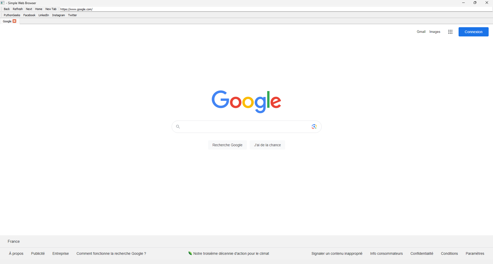
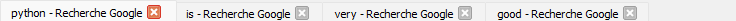

<h1>Simple Web Browser</h1>

    Simple Web Browser is a functional web browser built using PyQt5 and Qt WebEngine. 
    This project is designed to demonstrate how to create a basic web browser with tab support, 
    navigation controls, bookmarks, and keyboard shortcuts.

<h2>Features</h2>

    The Simple Web Browser includes the following features:

<ul>
    <li>Tabbed browsing</li>
    <li>Navigation controls (back, forward, refresh, home)</li>
    <li>Bookmark toolbar with popular websites</li>
    <li>Address bar for URL input and navigation</li>
    <li>Keyboard shortcuts for opening and closing tabs</li>
</ul>

<h2>Installation</h2>

    To run the Simple Web Browser, you need to have Python 3 and PyQt5 installed. 
    Follow these steps to install the required dependencies and run the application:

<pre>
    <code>
# Clone the repository
git clone https://github.com/devidodu55/SimpleWebBrowser.git

# Change to the project directory
cd SimpleWebBrowser

# Install the required dependencies
pip install PyQt5 PyQtWebEngine

# Run the application
python main.py
    </code>
</pre>

<h2>Usage</h2>

    Once the application is running, you can use the following features:

<ul>
    <li><strong>Tabbed browsing:</strong> Click the "New Tab" button or use <code>Ctrl+T</code> to open a new tab.</li>
    <li><strong>Close tab:</strong> Click the close button on a tab or use <code>Ctrl+W</code> to close the current tab.</li>
    <li><strong>Navigation controls:</strong> Use the back, forward, refresh, and home buttons in the navigation toolbar to control the browser.</li>
    <li><strong>Address bar:</strong> Enter a URL in the address bar and press Enter to navigate to the desired website.</li>
    <li><strong>Bookmarks:</strong> Click on any of the bookmarks in the bookmark toolbar to quickly navigate to popular websites.</li>
</ul>

<h2>Screenshots</h2>

    <h3>main windows :</h3>
    
     
     
     
    <h3>tabs :</h3>
    

<h2>Contributing</h2>

    Contributions are welcome! If you would like to contribute to this project, please fork the repository and submit a pull request.
    For major changes, please open an issue first to discuss what you would like to change.

